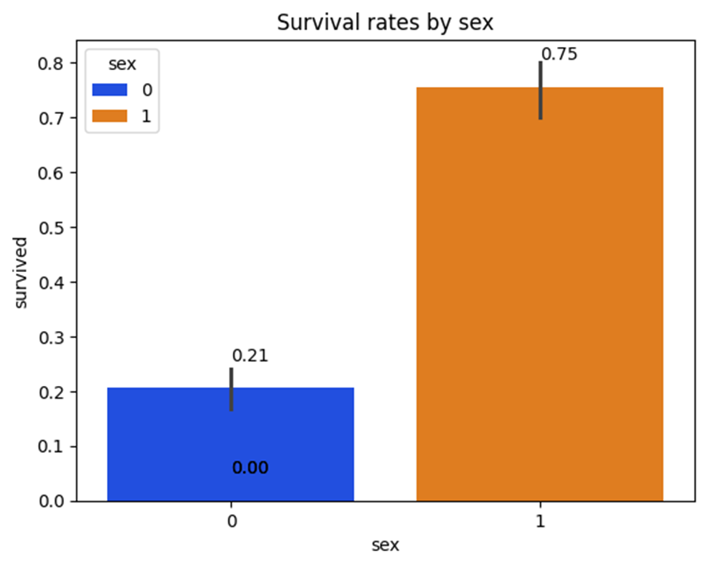
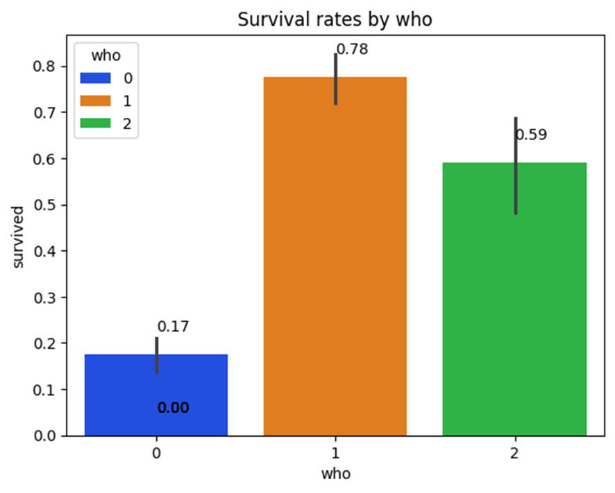
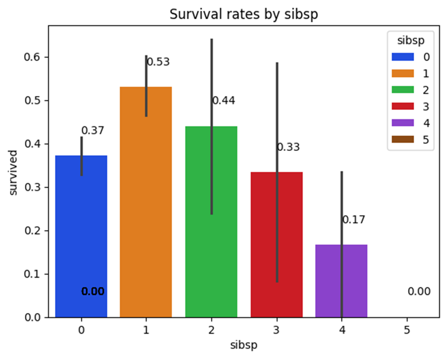
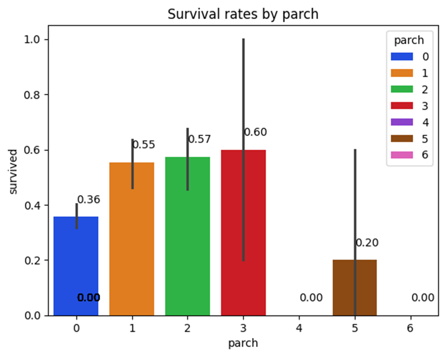
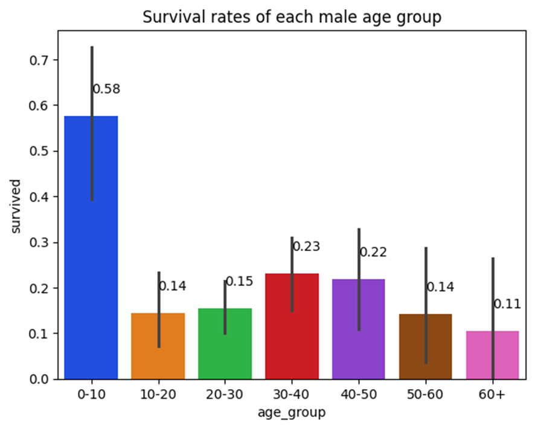

# Titanic Survival Analysis Project

## Overview
This project uses the Titanic dataset from the Seaborn library to analyze and predict survival rates during the Titanic disaster. Using Logistic Regression, the model answers the question: "Would I survive if I were in the Titanic Disaster?"

## Dataset
The analysis uses the built-in Titanic dataset from Seaborn library, which contains information about passengers and crew of the RMS Titanic. The dataset includes details about:
- Passenger demographics
- Ticket class
- Family relationships
- Survival status

## Data Cleaning
The following steps were taken to prepare the data:

### Removed Irrelevant Fields
- `embark_town` and `embark`: Port of embarkation (no impact on survival rates)
- `deck` and `fare`: No significant impact on survival rates
- `class` and `alive`: Redundant information (derived from `pclass` and `survived`)

### Handling Missing Values
- Removed all rows with missing values to improve model performance
- Prevented potential errors in the Logistic Regression model

### Data Transformation
Converted categorical data to numerical values:
- Sex: male → 0, female → 1
- Who: man → 0, woman → 1, child → 2

## Visualizations
The project includes five key visualizations:

1. **Survival Rates by Sex**
    
   - Shows significantly higher survival rates for females (75%) compared to males (21%)
   - Demonstrates priority given to women during evacuation

2. **Survival Rates by Category (Who)**
    
   - Women: 78% survival rate
   - Children: 59% survival rate
   - Male adults: 17% survival rate
   - Confirms "women and children first" policy

3. **Survival Rates by Siblings/Spouses (sibsp)**
    
   - Highest survival rate for passengers with 1 sibling/spouse
   - Lower survival rates for larger family groups

4. **Survival Rates by Parents/Children (parch)**
    
   - Optimal survival rate for passengers with 3 parents/children
   - Decreased survival rates for larger family groups

5. **Survival Rates by Male Age Groups**
    
   - Higher survival rates for younger males
   - Declining survival rates with increasing age
   - Lowest survival rates for males aged 60+

## Model Performance
- Algorithm: Logistic Regression
- Accuracy: 80.5% on test data

### Potential Improvements
- Collect additional data for better training
- Consider implementing Random Forest algorithm
- Feature engineering and selection optimization

## Test Case Scenario
Tested the model with the following passenger profile:
- Age: 19
- Gender: Male
- Class: Second class
- Traveling with: One older brother
- Prediction Result: Would not survive

## Conclusion
The Logistic Regression model achieved an accuracy of 80.5% in predicting Titanic disaster survival. The analysis revealed strong correlations between survival rates and factors such as gender, age, and family size, with women and children having significantly higher chances of survival.

## Technologies Used
- Python
- Seaborn Library
- Logistic Regression
- Data Visualization Tools

## Author
- The Hai Nguyen
- Student ID: 991745555
- Course: PROG25211
- Email: nguytheh@sheridancollege.ca